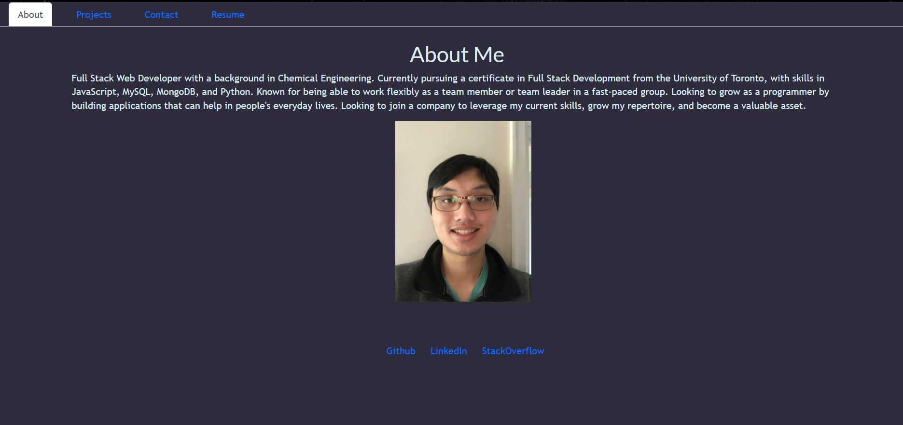

# Portfolio

## Description
This application is a portfolio showcasing my projects. On loading, users are directed to an 'About Me' page, which provides a summary of myself. The 'Projects' page showcaseseveral of my most recent projects, including links to the deployed site and their respective github repositories. The 'Contact' page includes a fully-functioning system using EmailJS that allows users to send me a message by including their name, email, and message. Lastly, the 'Resume' page includes a download of my resume, as well as a full list of proficiencies that I have.

## Table of Contents

- [Installation](#installation)
- [Usage](#usage)
- [Credits](#credits)
- [License](#license)
- [Tests](#tests)

## Installation

This application is deployed on Github Pages and does not require any additional installations

## Usage

The page is fully functional. All links and images have been tested and alt text has been provided where required. Below is an image of the screen you should arrive at on loading:

## Contributors

Here is a list of contributors to this application:

N/A

## License

N/A

## Tests

N/A

## Questions

Here are two links to reach out to me:

Github: https://github.com/Honsumal

Email: 14leealastair@gmail.com